# Food Delivery Data Engineering & AI Analytics Platform


> **Production-hardened end-to-end data platform for food-delivery analytics** — combining AWS S3, Snowflake, dbt, Apache Airflow, GitHub Actions, Google Gemini, Python, and Streamlit.

This project takes raw food-delivery CSV data from a cloud data lake through a governed Snowflake warehouse, transforms it into business-ready analytical models with dbt, orchestrates the workflow with Airflow, and exposes the curated data through three AI capabilities:

- **LLM Review Enrichment** — converts unstructured customer reviews into structured sentiment, topic, score, and issue insights.
- **RAG Review Chat** — retrieves semantically relevant reviews and generates grounded conversational answers.
- **Text-to-SQL Analytics** — converts natural-language business questions into validated, read-only Snowflake SQL.

The platform also demonstrates **incremental and idempotent processing, data-quality gates, Airflow reliability controls, Snowflake RBAC, PII masking, CI validation, and Dockerized orchestration**.

---

## 📑 Table of Contents

- [Architecture](#-architecture)
- [What the Project Demonstrates](#-what-the-project-demonstrates)
- [Technology Stack](#-technology-stack)
- [Data Sources](#-data-sources)
- [End-to-End Data Flow](#-end-to-end-data-flow)
- [Snowflake Data Model](#-snowflake-data-model)
- [dbt Transformation Layer](#-dbt-transformation-layer)
- [Incremental Processing](#-incremental-processing)
- [Data Quality](#-data-quality)
- [Airflow Orchestration](#-airflow-orchestration)
- [AI Layer](#-ai-layer)
- [Security & Governance](#-security--governance)
- [CI / GitHub Actions](#-ci--github-actions)
- [Repository Structure](#-repository-structure)
- [Dataset & Project Slides](#-dataset--project-slides)
- [Setup & Running](#-setup--running)
- [Implementation Evidence](#-implementation-evidence)
- [Production-Hardening Notes](#-production-hardening-notes)
- [Project Outcome](#-project-outcome)

---

## 🏗️ Architecture


### End-to-end architecture

```text
                                  ┌──────────────────────────┐
                                  │     GitHub Repository    │
                                  │ Python / SQL / dbt / DAG │
                                  └────────────┬─────────────┘
                                               │
                                        Push / Pull Request
                                               │
                                               ▼
                                  ┌──────────────────────────┐
                                  │      GitHub Actions      │
                                  │       dbt parse CI      │
                                  └──────────────────────────┘

  ┌─────────────────┐
  │   Source CSVs   │
  │                 │
  │ restaurants     │
  │ users           │
  │ food            │
  │ menu            │
  │ orders          │
  │ order_items     │
  │ reviews         │
  └────────┬────────┘
           │
           ▼
  ┌─────────────────┐
  │     AWS S3      │
  │    Data Lake    │
  └────────┬────────┘
           │
           │ Storage Integration + IAM Role
           ▼
  ┌──────────────────────────────────────────────────────────┐
  │                       SNOWFLAKE                           │
  │                                                          │
  │  RAW              STAGING                    MARTS       │
  │  ───              ───────                    ─────       │
  │  source tables →  clean/type/cast  →  dimensions        │
  │                                         facts             │
  │                                         business marts   │
  │                                                          │
  │                         AI                               │
  │                  REVIEW_ENRICHED                         │
  └──────────────────────────┬───────────────────────────────┘
                             │
                 ┌───────────┼────────────┐
                 │           │            │
                 ▼           ▼            ▼
          Review Enrichment  RAG       Text-to-SQL
                 │           │            │
              Gemini      Embeddings    Gemini
                 │           │            │
                 ▼           ▼            ▼
             AI tables   Top-K reviews  SQL + safety
                 │           │            │
                 └───────────┴────────────┘
                             │
                             ▼
                       ┌────────────┐
                       │ Streamlit  │
                       │ AI / Data  │
                       │   Apps     │
                       └────────────┘

                         AIRFLOW
                            │
                            ▼
      reload_raw → dbt_build_core → enrich_reviews → dbt_build_ai
```

### Architectural principles

| Principle | Implementation |
|---|---|
| **Separation of concerns** | S3 = storage, Snowflake = warehouse, dbt = transformation, Airflow = orchestration, Gemini = AI, Streamlit = presentation |
| **Medallion-style layering** | RAW / Bronze → STAGING / Silver → MARTS / Gold |
| **ELT** | Data is loaded into Snowflake before the main transformation layer |
| **Incremental processing** | Large fact models use incremental MERGE logic rather than full rebuilds |
| **Data quality gates** | dbt tests validate analytical assumptions before downstream consumption |
| **Least privilege** | Snowflake roles separate transformation, analyst, and AI read access |
| **AI on governed data** | AI consumes curated warehouse data instead of bypassing the warehouse |
| **CI validation** | GitHub Actions validates the dbt project on pushes and pull requests |

---

## 🎯 What the Project Demonstrates

This is designed as a **portfolio-grade, production-style Data Engineering project**, not a collection of isolated scripts.

### Data Engineering

- Cloud data-lake ingestion with AWS S3
- Snowflake cloud data warehousing
- External stage + `COPY INTO`
- RAW → STAGING → MART layered architecture
- dbt SQL transformation and lineage
- Dimensional modeling
- Incremental fact processing
- Idempotent MERGE-based processing
- Business-oriented analytical marts

### Reliability & Quality

- `unique` tests
- `not_null` tests
- `relationships` tests
- `accepted_values` tests
- Incremental model configuration
- Schema-change handling
- Airflow task dependencies
- Airflow retries and execution timeouts

### Security & Governance

- AWS IAM role for Snowflake → S3 access
- Snowflake role-based access control
- Dedicated transformation / analyst / AI roles
- Read-oriented AI access model
- Dynamic PII masking for customer email

### AI / Analytics

- Gemini-powered review enrichment
- Gemini embeddings
- Cosine-similarity retrieval
- RAG review chatbot
- Natural-language Text-to-SQL
- SQL safety validation
- Business-aware SQL generation against curated marts

### DevOps / Applications

- GitHub Actions CI
- Dockerized Airflow environment
- Streamlit business-facing applications
- Architecture and implementation evidence inside the repository

---

## 🧰 Technology Stack

| Layer | Technology | Purpose |
|---|---|---|
| Source | CSV | Food-delivery operational data |
| Data Lake | **AWS S3** | Raw object storage / landing zone |
| Cloud Warehouse | **Snowflake** | Analytical storage and SQL execution |
| Transformation | **dbt + dbt-snowflake** | Staging, facts, dimensions, marts, tests |
| Orchestration | **Apache Airflow** | Scheduling and dependency management |
| Runtime | **Docker / Docker Compose** | Reproducible Airflow environment |
| AI / LLM | **Google Gemini** | Review enrichment and generation |
| Embeddings | **Gemini Embeddings** | Semantic review retrieval |
| Data Processing | **Python / Pandas** | AI and application processing |
| Applications | **Streamlit** | RAG and Text-to-SQL interfaces |
| CI | **GitHub Actions** | Automated dbt project validation |
| Version Control | **Git / GitHub** | Source control and collaboration |
| Query Language | **Snowflake SQL** | Ingestion, modeling and analytics |

---

## 📊 Data Sources

The platform works with seven food-delivery source domains:

```text
data/
├── restaurants/
├── users/
├── food/
├── menu/
├── orders/
├── order_items/
└── reviews/
```

The raw files are intentionally **not committed to Git** because of their size. They are downloaded separately and then placed under `data/` for local use.

---

# 🔄 End-to-End Data Flow

## 1. Source Data → AWS S3

The seven CSV source domains are organized into S3 prefixes such as:

```text
raw/
├── restaurant/
├── users/
├── food/
├── menu/
├── orders/
├── order_items/
└── reviews/
```

S3 acts as the durable **data lake / landing layer**.

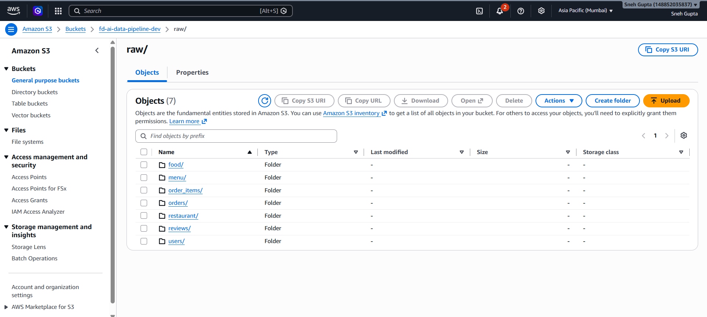

---

## 2. AWS S3 → Snowflake RAW

Snowflake reads the S3 bucket through a **storage integration + IAM role**, avoiding hard-coded cloud credentials in the ingestion SQL.

```text
AWS S3
   │
   │ Snowflake Storage Integration
   ▼
External Stage
   │
   ▼
COPY INTO
   │
   ▼
Snowflake RAW
```

The Snowflake setup is intentionally split into ordered scripts:

```text
snowflake/
├── 01_setup.sql
├── 02_storage_integration.sql
├── 03_stage_and_formats.sql
├── 04_raw_tables.sql
├── 05_copy_into.sql
├── 06_governance.sql
└── 07_pii_masking.sql
```

### AWS IAM evidence

The IAM role is used to establish the S3 access boundary required by the Snowflake storage integration.

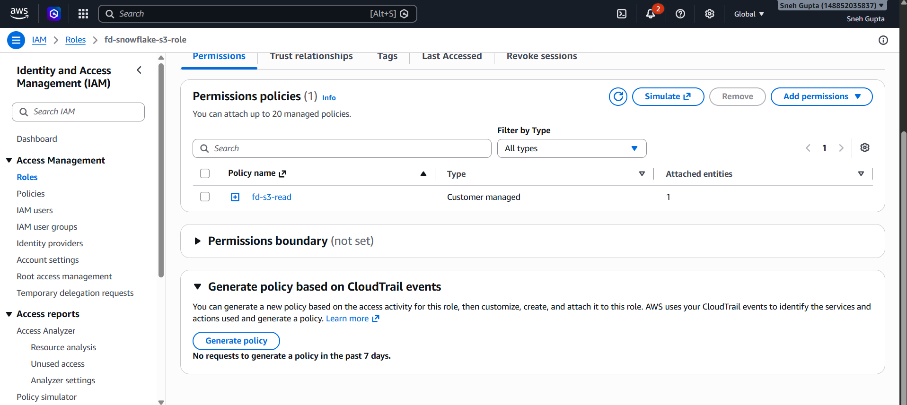

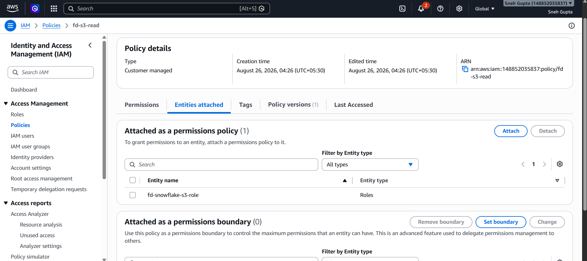

---

## 3. Snowflake RAW Layer

The RAW schema preserves the source-oriented representation before dbt transformations.

```text
FOOD_DELIVERY.RAW
├── RESTAURANTS
├── USERS
├── FOOD
├── MENU
├── ORDERS
├── ORDER_ITEMS
└── REVIEWS
```

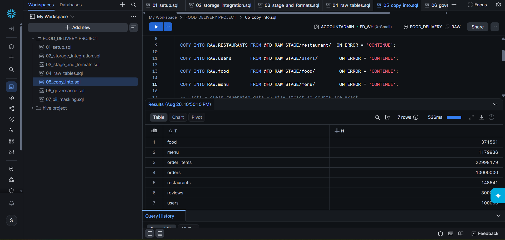

### Ingestion behavior

Source/dimension data uses a tolerant ingestion strategy where appropriate, while generated fact data can use stricter error handling. This keeps messy external source data from being treated exactly like controlled/generated data.

---

## 4. dbt STAGING Layer

dbt takes over after ingestion.

The staging layer standardizes source data through operations such as:

- type casting
- cleaning
- naming normalization
- null handling
- basic derived fields
- source-specific parsing

```text
RAW
 │
 ▼
STAGING
├── STG_RESTAURANTS
├── STG_USERS
├── STG_FOOD
├── STG_MENU
├── STG_ORDERS
├── STG_ORDER_ITEMS
└── STG_REVIEWS
```

The staging models are views so that the layer remains lightweight and closely connected to RAW.

---

## 5. dbt CORE / MARTS

The analytical layer follows a dimensional-modeling approach.

### Dimensions

```text
DIM_CUSTOMER
DIM_DATE
DIM_FOOD
DIM_RESTAURANTS
```

### Facts

```text
FCT_ORDERS
FACT_ORDER_ITEMS
```

### Business marts

```text
MART_DAILY_CITY_REVENUE
MART_DELIVERY_SLA
MART_RESTAURANT_PERFORMANCE
MART_REVIEW_INSIGHTS
```

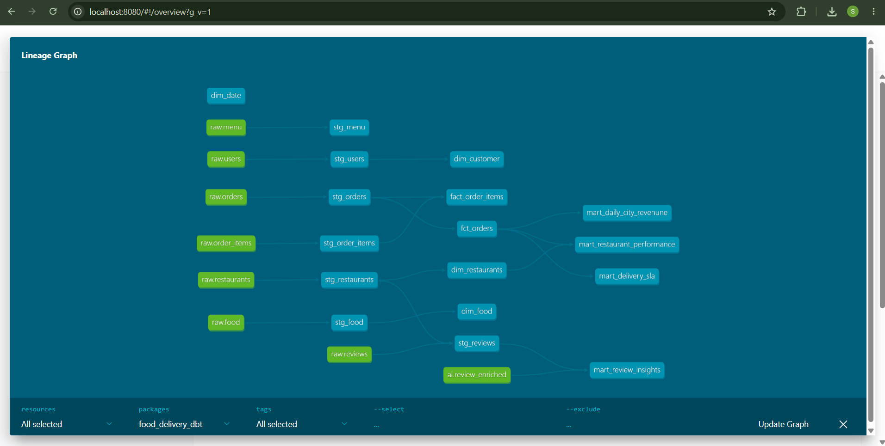

### Example lineage

```text
RAW.RESTAURANTS ──→ STG_RESTAURANTS ──→ DIM_RESTAURANTS
RAW.USERS ─────────→ STG_USERS ─────────→ DIM_CUSTOMER
RAW.FOOD ──────────→ STG_FOOD ──────────→ DIM_FOOD
RAW.ORDERS ────────→ STG_ORDERS ────────→ FCT_ORDERS
RAW.ORDER_ITEMS ──→ STG_ORDER_ITEMS ──→ FACT_ORDER_ITEMS
RAW.REVIEWS ───────→ STG_REVIEWS ──────→ AI enrichment
                                           │
                                           ▼
                                   REVIEW_ENRICHED
                                           │
                                           ▼
                                   MART_REVIEW_INSIGHTS
```

---

# ⚡ Incremental Processing

Large fact models are configured for incremental processing rather than rebuilding the full table on every run.

`FCT_ORDERS` uses:

```text
materialized          = incremental
unique_key             = order_id
incremental_strategy   = merge
on_schema_change       = append_new_columns
```

Conceptually:

```text
                 First Run
                    │
                    ▼
              Build initial fact

Later Run
    │
    ▼
New / changed records
    │
    ▼
MERGE using business key
    │
    ├── UPDATE existing
    └── INSERT new
    │
    ▼
Updated FCT_ORDERS
```

This provides a practical **incremental + idempotent processing** pattern and avoids unnecessary full rebuilds.

---

# ✅ Data Quality

The dbt layer acts as a quality gate for the analytical warehouse.

Implemented tests include:

```text
unique
not_null
relationships
accepted_values
```

Examples:

```text
FCT_ORDERS.order_id
├── unique
└── not_null

FCT_ORDERS.customer_id
└── relationship → DIM_CUSTOMER.customer_id

FCT_ORDERS.order_status
└── accepted values
```

`dbt build` runs models and tests in dependency order, so failures in critical assumptions can stop downstream progression.

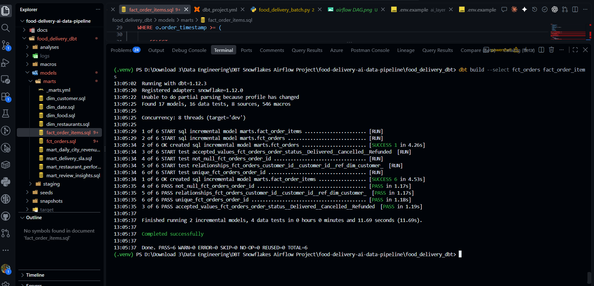

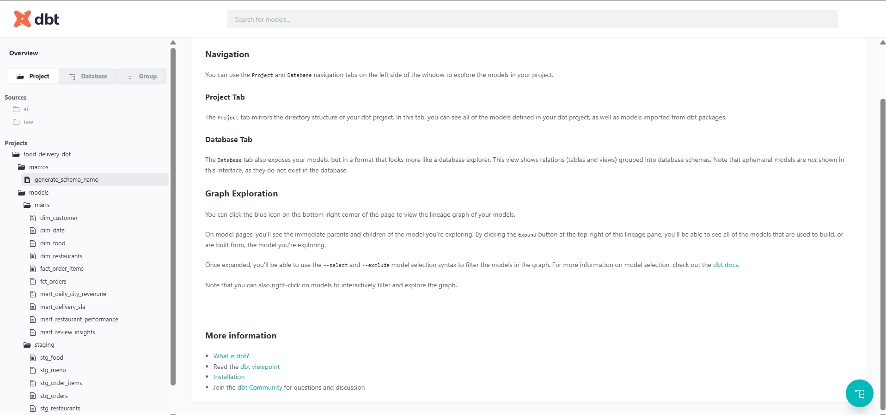

---

# 🌀 Airflow Orchestration

Airflow coordinates the complete production data path.

```text
reload_raw
    │
    ▼
dbt_build_core
    │
    ▼
enrich_reviews + Gemini
    │
    ▼
dbt_build_ai
```

The DAG is:

```text
food_delivery_batch
```

### Task responsibilities

| Task | Responsibility |
|---|---|
| `reload_raw` | Executes the Snowflake `COPY INTO` statements for the RAW layer |
| `dbt_build_core` | Builds the core dbt models and tests |
| `enrich_reviews` | Runs Gemini review enrichment |
| `dbt_build_ai` | Builds AI-tagged downstream dbt models |

### Reliability controls

The DAG is configured with:

```text
retries = 2
retry_delay = 5 minutes
execution_timeout = 30 minutes
catchup = false
schedule = @daily
```

This gives the workflow basic protection against transient failures and runaway tasks.

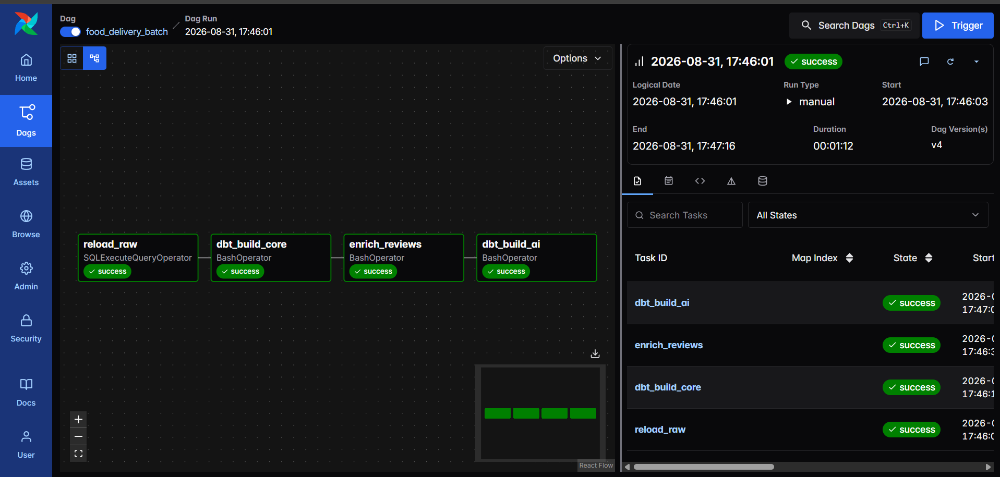

---

# 🤖 AI Layer

The AI layer is intentionally split into three capabilities rather than one monolithic chatbot.

```text
                         AI LAYER
                            │
           ┌────────────────┼────────────────┐
           │                │                │
           ▼                ▼                ▼
    Review Enrichment     RAG Chat      Text-to-SQL
           │                │                │
         Gemini          Embeddings         Gemini
           │                │                │
           ▼                ▼                ▼
     Structured AI      Top-K reviews     Safe SQL
        fields          + grounding       + execution
```

---

## 1. Review Enrichment — LLM as a Transformation Step

Customer reviews are processed with Gemini and converted from free text into structured analytical fields.

```text
STG_REVIEWS
    │
    ▼
Gemini
    │
    ├── sentiment_label
    ├── sentiment_score
    ├── topic
    └── key_issue
    │
    ▼
FOOD_DELIVERY.AI.REVIEW_ENRICHED
    │
    ▼
MART_REVIEW_INSIGHTS
```

This makes unstructured customer feedback queryable alongside the rest of the analytical warehouse.

The enrichment process also avoids unnecessarily re-processing reviews that are already present in the AI table.

---

## 2. RAG Review Chat — Chat with Reviews

The RAG application lets a business user ask questions about customer reviews.

```text
Reviews
   │
   ▼
Gemini Embeddings
   │
   ▼
Embedding cache
   │
   ▼
User question
   │
   ▼
Question embedding
   │
   ▼
Cosine similarity
   │
   ▼
Top-K relevant reviews
   │
   ▼
Gemini
   │
   ▼
Grounded answer
```

The application is designed to answer from the retrieved review context, remain concise and factual, avoid invented claims, and acknowledge when the retrieved context is insufficient.

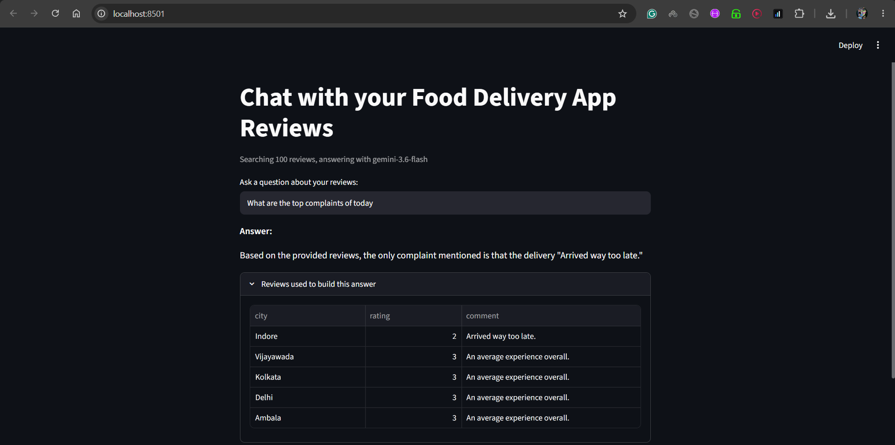

Run locally:

```bash
cd ai_layer
streamlit run rag_chat.py
```

---

## 3. Text-to-SQL — Chat with the Warehouse

The Text-to-SQL application gives business users a natural-language interface to curated Snowflake analytics.

Example question:

```text
Top 10 cities by GMV
```

Pipeline:

```text
Business question
       │
       ▼
     Gemini
       │
       ▼
Generated SQL
       │
       ▼
SQL safety validation
       │
       ▼
Snowflake MARTS
       │
       ▼
Pandas DataFrame
       │
       ▼
Streamlit result
```

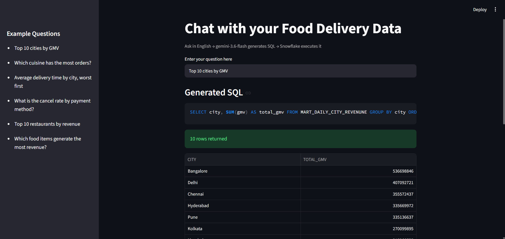

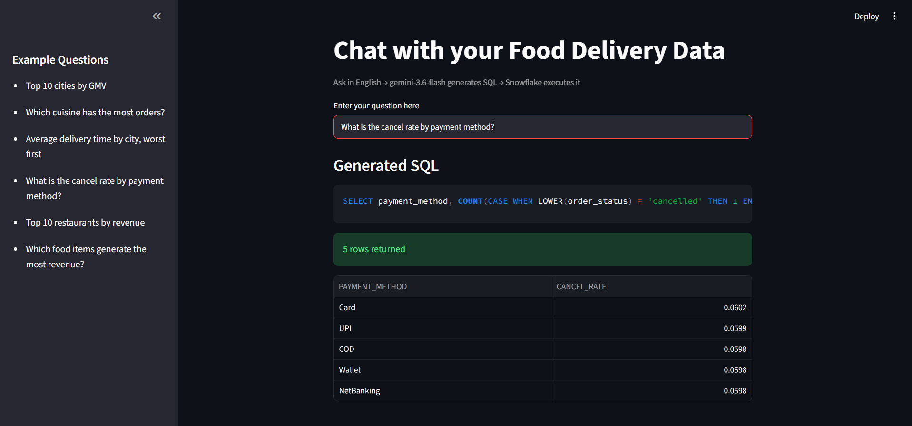

### SQL safety

The application is designed to allow read-only query patterns such as:

```text
SELECT ...
WITH ... SELECT ...
```

and reject administrative or data-modification keywords such as:

```text
DROP
DELETE
TRUNCATE
ALTER
UPDATE
INSERT
CREATE
REPLACE
GRANT
REVOKE
```

The LLM is also provided with explicit warehouse schema and business semantics so it can target known curated models instead of inventing arbitrary tables and columns.

### Business semantics

Examples include:

```text
City-level revenue / GMV / AOV / cancellation
    → MART_DAILY_CITY_REVENUE

Restaurant performance
    → MART_RESTAURANT_PERFORMANCE

Delivery performance
    → MART_DELIVERY_SLA

Detailed order analysis
    → FCT_ORDERS

Food-item analysis
    → FACT_ORDER_ITEMS
```

This semantic layer makes natural-language analytics more deterministic and aligned with the warehouse design.

---

# 🔐 Security & Governance

Security is implemented as part of the data platform rather than added only at the application layer.

## Snowflake RBAC

The governance layer defines dedicated roles:

```text
FD_DBT_ROLE
FD_ANALYST_ROLE
FD_AI_READ_ROLE
```

Conceptually:

```text
                         Snowflake
                             │
          ┌──────────────────┼──────────────────┐
          │                  │                  │
          ▼                  ▼                  ▼
    FD_DBT_ROLE       FD_ANALYST_ROLE     FD_AI_READ_ROLE
     Transform            Read-only           Read-only
```

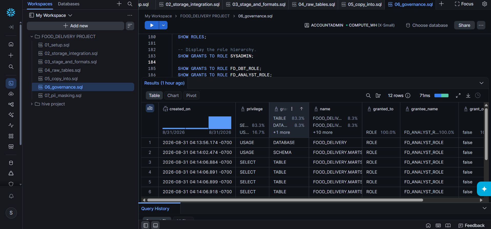

### Analyst access

The analyst role is intended for read access to curated MARTS objects.

### AI access

The dedicated AI role is intended to provide read-only access to the analytical layer, following the least-privilege principle.

### dbt access

The transformation role is intended to have the permissions required for dbt to read source/staging data and build analytical models.

---

## PII Masking

Customer email is protected with a Snowflake masking policy.

Conceptually:

```text
Original value
    │
    ▼
john@gmail.com
    │
    ▼
Analyst view
    │
    ▼
j***@gmail.com
```

The policy is applied to:

```text
FOOD_DELIVERY.MARTS.DIM_CUSTOMER.EMAIL
```

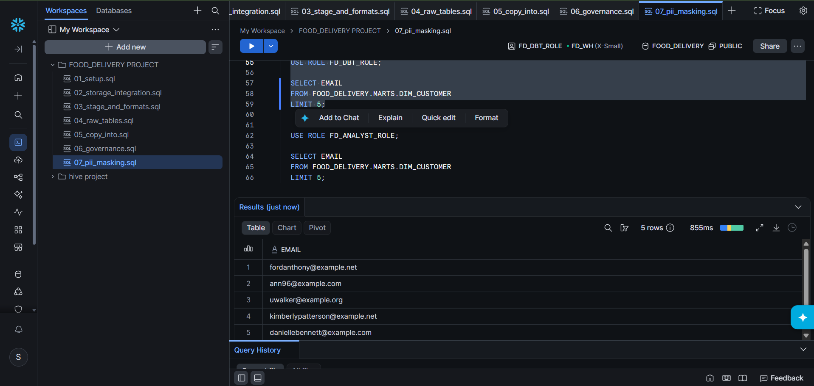

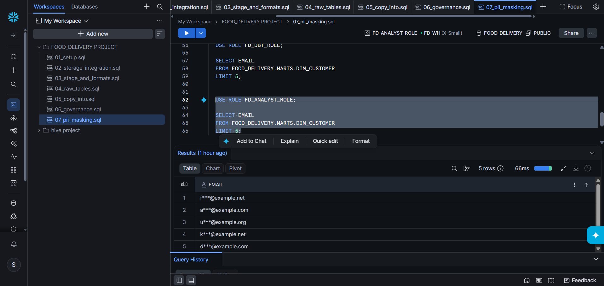

---

# 🔧 CI / GitHub Actions

The repository includes:

```text
.github/workflows/dbt_ci.yml
```

The workflow runs for:

```text
push → main
pull_request → main
```

Current CI flow:

```text
Checkout
   │
   ▼
Install Python
   │
   ▼
Install dbt + Snowflake adapter
   │
   ▼
Create CI dbt profile
   │
   ▼
dbt parse
```

This validates the dbt project's structure, SQL/Jinja parsing, references, sources, model configuration and test definitions.

> **Important:** the current CI workflow performs `dbt parse`; it does not execute the full dbt build against Snowflake. This is intentionally documented rather than presented as full deployment CI/CD.

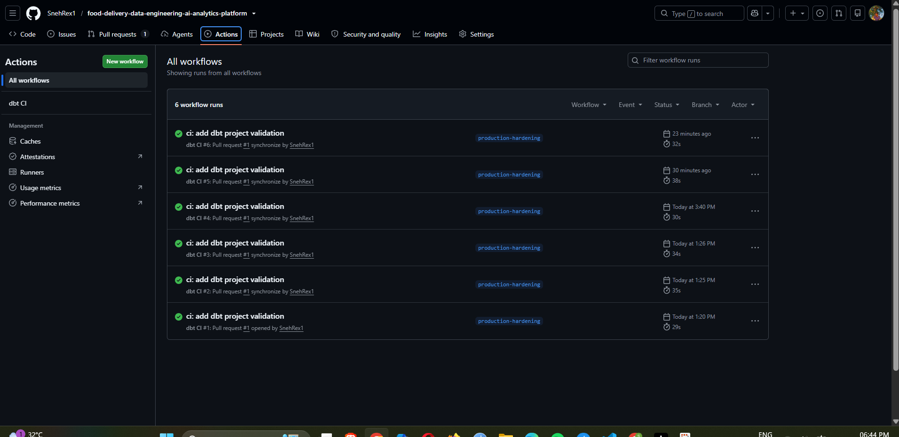

---

# 🐳 Airflow + Docker

Airflow is containerized using Docker Compose for a reproducible local orchestration environment.

The environment includes the Airflow services and PostgreSQL metadata storage defined in `airflow/docker-compose.yaml`.

Start it with:

```bash
cd airflow
docker compose build
docker compose up -d
```

Check the containers:

```bash
docker compose ps
```

The repository keeps credentials out of source code by using environment variables / `.env` files based on the supplied examples.

---

# 📁 Repository Structure

```text
food-delivery-data-engineering-ai-analytics-platform-production-hardening/
│
├── .github/
│   └── workflows/
│       └── dbt_ci.yml
│
├── architecture/
│   ├── 00-architecture.png
│   └── food-delivery-architecture.html
│
├── aws/
│   ├── 01-s3-raw-data-lake.png
│   └── iam/
│       ├── 02-iam-snowflake-s3-role-permissions.png
│       └── 03-iam-s3-read-policy-attached-role.png
│
├── food_delivery_dbt/
│   ├── models/
│   │   ├── staging/
│   │   └── marts/
│   ├── macros/
│   ├── snapshots/
│   ├── tests/
│   ├── dbt_project.yml
│   └── profiles.yml.example
│
├── ai_layer/
│   ├── enrich_reviews.py
│   ├── rag_chat.py
│   ├── text_to_sql.py
│   └── .env.example
│
├── airflow/
│   ├── dags/
│   │   └── food_delivery_batch.py
│   ├── Dockerfile
│   ├── docker-compose.yaml
│   └── .env.example
│
├── snowflake/
│   ├── 01_setup.sql
│   ├── 02_storage_integration.sql
│   ├── 03_stage_and_formats.sql
│   ├── 04_raw_tables.sql
│   ├── 05_copy_into.sql
│   ├── 06_governance.sql
│   └── 07_pii_masking.sql
│
├── screenshots/
│   ├── 00-architecture.png
│   ├── 01-snowflake-raw-ingestion.png
│   ├── 02-dbt-lineage.png
│   ├── 03-airflow-success.png
│   ├── 04-dbt-docs-overview.png
│   ├── 05-dbt-build-tests.png
│   ├── 06-snowflake-rbac.png
│   ├── 07-pii-masking-analyst.png
│   ├── 08-github-actions-ci.png
│   ├── 09-rag-review-chat.png
│   ├── 10-text-to-sql-gmv.png
│   ├── 11-text-to-sql-cancel-rate.png
│   ├── 12-pii-masking-verification.png
│   ├── 13-raw-reviews-table.png
│   └── 14-staging-order-items-table.png
│
├── docs/
│   └── 00-architecture.png
│
├── .gitignore
└── README.md
```

---

# 📂 Dataset + Project Slides

The source dataset is intentionally excluded from Git because the CSVs are too large to commit.

📂 **Dataset + project slides:** [Google Drive folder](https://drive.google.com/drive/folders/1FEnGWMHhHzzTUCZOw1-YnH2v3DMuM-rs?usp=sharing) — download the CSVs here and place them under `data/`.

Expected local layout:

```text
data/
├── restaurants/
├── users/
├── food/
├── menu/
├── orders/
├── order_items/
└── reviews/
```

---

# 🚀 Setup & Running

## Prerequisites

Install / configure:

- Python 3.x
- Git
- Docker Desktop
- dbt with the Snowflake adapter
- Snowflake account
- AWS account / S3 bucket
- Google Gemini API key

---

## 1. Get the project

```bash
git clone https://github.com/SnehRex1/food-delivery-data-engineering-ai-analytics-platform.git
cd food-delivery-data-engineering-ai-analytics-platform
```

Download the dataset from the Google Drive folder above and place it under `data/`.

---

## 2. Configure AWS + Snowflake

Run the Snowflake setup scripts in order from Snowsight:

```text
snowflake/01_setup.sql
snowflake/02_storage_integration.sql
snowflake/03_stage_and_formats.sql
snowflake/04_raw_tables.sql
snowflake/05_copy_into.sql
snowflake/06_governance.sql
snowflake/07_pii_masking.sql
```

The exact values for your AWS bucket, role ARN, Snowflake account and credentials must be supplied for your environment. Do not commit secrets.

---

## 3. Configure dbt

Use the supplied profile template:

```text
food_delivery_dbt/profiles.yml.example
```

Create your local dbt profile with environment-specific Snowflake credentials.

Then:

```bash
cd food_delivery_dbt
dbt debug
dbt build --exclude tag:ai
```

---

## 4. Run the AI enrichment

Configure:

```text
ai_layer/.env.example
```

with your Gemini and Snowflake environment variables.

Then:

```bash
python ai_layer/enrich_reviews.py
```

---

## 5. Run the RAG application

```bash
cd ai_layer
streamlit run rag_chat.py
```

---

## 6. Run Text-to-SQL

```bash
cd ai_layer
streamlit run text_to_sql.py
```

---

## 7. Run the complete Airflow workflow

Configure:

```text
airflow/.env.example
```

Then:

```bash
cd airflow
docker compose build
docker compose up -d
```

Open the Airflow UI configured by the Docker Compose environment, unpause `food_delivery_batch`, and trigger a run.

The DAG executes:

```text
reload_raw
    ↓
dbt_build_core
    ↓
enrich_reviews
    ↓
dbt_build_ai
```

---

# 🖼️ Implementation Evidence

The repository contains screenshots so the project can be evaluated without access to the original cloud environment.

## Architecture

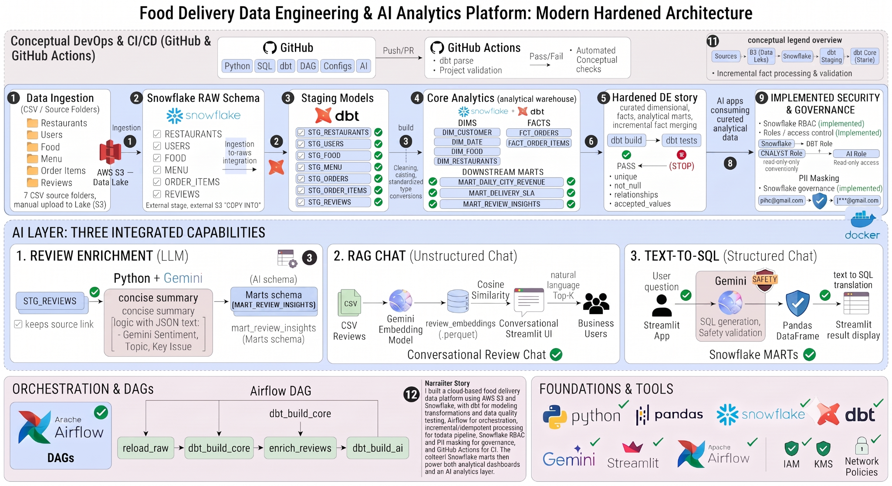

## Snowflake RAW ingestion


## dbt lineage


## Airflow successful execution


## dbt documentation


## dbt build + tests


## Snowflake RBAC


## PII masking


## GitHub Actions


## RAG review chat


## Text-to-SQL analytics


## Additional warehouse evidence

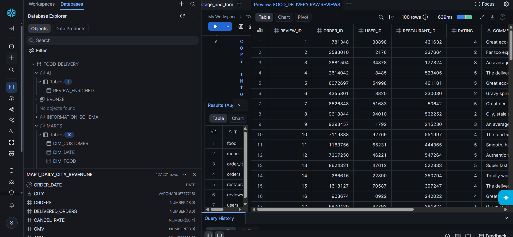

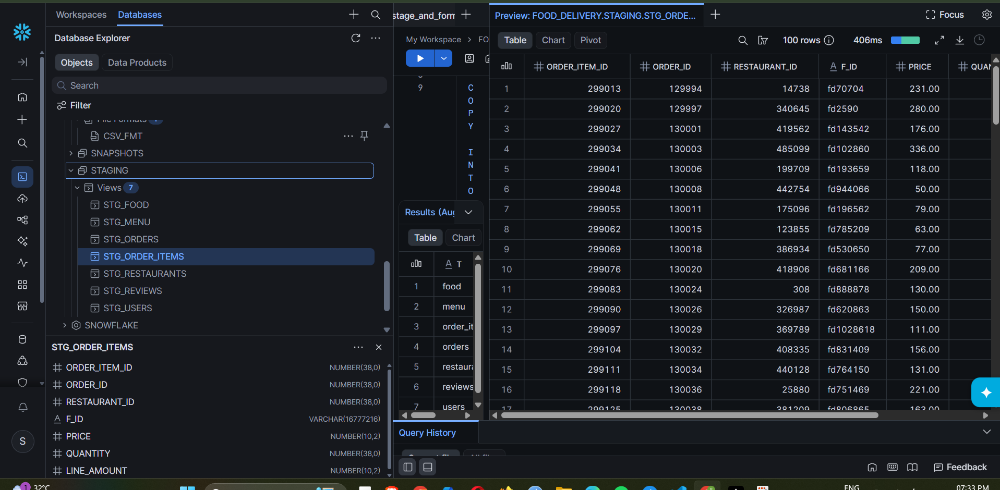

---

# 🛡️ Production-Hardening Notes

The project distinguishes **implemented controls** from possible future production work.

### Implemented

```text
✓ S3 → Snowflake ingestion
✓ Snowflake layered schemas
✓ dbt staging + marts
✓ Dimensional modeling
✓ Incremental fact processing
✓ MERGE / idempotent processing pattern
✓ Schema-change handling
✓ dbt data-quality tests
✓ Airflow orchestration
✓ Airflow retries and execution timeouts
✓ Gemini review enrichment
✓ Embedding-based RAG
✓ Text-to-SQL
✓ SQL safety validation
✓ Snowflake RBAC
✓ PII masking
✓ AWS IAM integration
✓ GitHub Actions dbt parse CI
✓ Dockerized Airflow
✓ Architecture documentation
✓ Implementation screenshots
```

### Recommended next steps for a stricter production deployment

```text
→ Connect the Text-to-SQL application to FD_AI_READ_ROLE end-to-end
→ Align DBT_ROLE vs FD_DBT_ROLE naming across every environment
→ Add authenticated production Streamlit deployment
→ Replace keyword-only SQL checks with parser / AST validation
→ Run Snowflake-backed dbt tests in CI
→ Add centralized alerting and observability
→ Move the local embedding cache to managed/shared storage
→ Add embedding versioning and refresh management
```

These are intentionally documented as **future hardening**, not claimed as completed features.

---

# 💡 Why This Architecture?

### Why S3 + Snowflake?

S3 provides a durable cloud landing/data-lake layer, while Snowflake provides the governed analytical warehouse.

### Why dbt?

dbt keeps SQL transformations modular, testable, documented and lineage-aware.

### Why Airflow if dbt already exists?

dbt handles transformation/modeling/testing; Airflow handles scheduling, dependencies, retries and cross-step orchestration.

### Why incremental facts?

Large fact tables should not be fully rebuilt when only new or changed business records need to be processed.

### Why AI on top of marts?

The AI layer should consume trusted, governed business data rather than bypassing the warehouse and querying raw operational data directly.

### Why both RAG and Text-to-SQL?

They solve different problems:

```text
RAG
User question → retrieve relevant unstructured reviews → grounded answer

Text-to-SQL
User question → generate analytical SQL → validate → query structured marts
```

---

# 🧠 Project in One Sentence

> **I built a production-style food-delivery data platform where CSV operational data lands in AWS S3, is ingested into Snowflake RAW through a storage integration, transformed and tested with dbt into dimensional facts and business marts, orchestrated end-to-end with Airflow, governed with RBAC and PII masking, validated through GitHub Actions, and exposed through Gemini-powered review enrichment, RAG, and safety-validated Text-to-SQL applications.**

---

# 🎤 Interview-Friendly Architecture

```text
S3
 ↓
Snowflake RAW
 ↓
dbt STAGING
 ↓
dbt CORE / MARTS
 ↓
Data Quality + Governance
 ↓
Airflow Orchestration
 ↓
┌─────────────────────────────────────┐
│ AI Layer                            │
│                                     │
│ Review Enrichment | RAG | Text-SQL  │
└─────────────────────────────────────┘
 ↓
Streamlit
```

The key mental model is:

> **S3 → Snowflake RAW → dbt STAGING → dbt CORE/MARTS → Quality/Governance → Airflow → AI → Streamlit**

---

# 📌 Project Outcome

The result is a single platform connecting:

```text
Cloud Storage
      +
Cloud Data Warehouse
      +
Data Transformation
      +
Incremental Processing
      +
Workflow Orchestration
      +
Data Quality
      +
Security & Governance
      +
Generative AI
      +
Business Applications
      +
CI Validation
```

which turns raw operational data into:

```text
Reliable analytical data
          +
AI-enriched customer intelligence
          +
Natural-language analytics
```

---

## 📄 License

This project is intended as a portfolio / educational Data Engineering and AI Analytics implementation.

